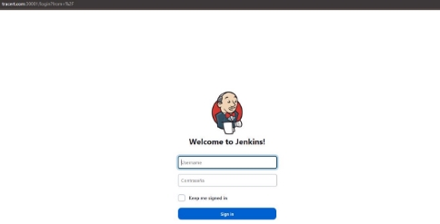

Iván Pérez Doña (TraceRt)

**Setting up Nginx as a Reverse Proxy for Apache using K8s (istio enabled)**

1. **Instalar kind: [https://kind.sigs.k8s.io/docs/user/quick-start/#installation**](https://kind.sigs.k8s.io/docs/user/quick-start/#installation)**
1. **Crear archivo de configuración de cluster (cluster-config.yaml):** 

**kind: Cluster**

**apiVersion: kind.x-k8s.io/v1alpha4 nodes:** 

- **role: control-plane** 

`  `**extraPortMappings:**

- **containerPort: 30000 hostPort: 30000**

**protocol: TCP**

**NOTAS:**  

- **el extraPortMappings es importante para entornos que usen Docker Desktop, porque sino  la  configuración  de  kind  impide  luego  acceder  a  contenidos  del  servidor Apache (u otro) a través de localhost:30000  (u otro puerto mayor que el 30000). Para más documentación: [https://kind.sigs.k8s.io/docs/user/configuration/#extra-port-mappings** ](https://kind.sigs.k8s.io/docs/user/configuration/#extra-port-mappings)**

Iván Pérez Doña (TraceRt)

- **Se podrían añadir workers con la línea**
3. **Crear el clúster y comprobar estado kind create cluster --config=cluster kubectl cluster-info** 

**NOTA: para lo último, debería salir algo así**

**:   -role: worker**

**:** 

**-config.yaml --name=trainingPath**

**:** 

Iván Pérez Doña (TraceRt)

4. **Archivos de configuración de los pods (Apache y Nginx):**

**NOTA:  Tanto el service como el deployment están en el mismo yaml, para ahorrar  en kubectl apply -f. Se podría usar kustomize también para ahorrar tiempo de despliegue.**

**nginx.yaml:** 

**apiVersion: v1**

**kind: Service metadata:**

`  `**name: nginx**

**spec:** 

`  `**type: NodePort**

`  `**ports:**

- **name: http**

**port: 80**

**protocol: TCP**

**targetPort: 80**

**nodePort: 30000   selector:**

**app: nginx**

**---** 

**apiVersion: apps/v1**

**kind: Deployment**

**metadata:**

`  `**name: nginx**

**spec:** 

`  `**selector:**

**matchLabels:**

**app: nginx**

`  `**replicas: 1**

`  `**template:**

**metadata:**

**labels:**

**app: nginx**

**spec:** 

**containers:**

- **name: nginx**

**image: nginx:latest ports:**

- **containerPort: 80 volumeMounts:**
- **name: nginx-conf mountPath: /etc/nginx/**

**volumes:** 

- **name: nginx-conf configMap:**

**name: nginx-conf** 

**apache-yaml:** 

**apiVersion: v1**

**kind: Service**

**metadata:**

`  `**name: apache**

`  `**labels:**

**app: apache**

**spec:** 

`  `**ports:**

- **name: http**

**port: 8080**

**targetPort: 80**

`  `**selector:**

**app: apache**

**---** 

**apiVersion: apps/v1**

**kind: Deployment**

**metadata:**

`  `**name: apache** 

**spec:** 

`  `**selector:**

**matchLabels:**

**app: apache**

`  `**replicas: 1**

`  `**template:**

**metadata:**

**labels:**

**app: apache**

**spec:** 

**containers:**

- **name: apache image: httpd:latest ports:**
  - **containerPort: 80 volumeMounts:**
  - **name: html**

**mountPath: /usr/local/apache2/htdocs/ volumes:** 

- **name: html**

**configMap:**

**name: html**

5. **Crear el ConfigMap para configurar nginx como reverse proxy (nginx-conf.yaml)** 

**apiVersion: v1**

**kind: ConfigMap**

**metadata:**

`  `**name: nginx-conf** 

**data:** 

`  `**nginx.conf: |**

**events {**

**worker\_connections  1024;**

**}** 

**http {**

**server {**

**listen 80;**

**server\_name localhost;**

**location / {**

**index index.html;**

**proxy\_pass http://apache:8080/;**

**proxy\_set\_header Host $host;**

**proxy\_set\_header X-Real-IP $remote\_addr;**

**proxy\_set\_header X-Forwarded-For $proxy\_add\_x\_forwarded\_for; }** 

**}** 

**}** 

**NOTA:** 

- **La  directiva  worker\_connections  controla  el  número  máximo  de  conexiones simultáneas  que  pueden  ser  manejadas  por  un  worker  process  de  Nginx.  Se  debe escalar al tráfico, 1024 es un ejemplo.**
- **Está mapeado el puerto 80 de apache al 8080 para evitar conflictos con el pod de nginx.** 
6. **Aplicar configuraciones al clúster:**

**kubectl apply -f nginx.yaml kubectl apply -f apache.yaml kubectl apply -f nginx-conf.yaml**

**NOTA: nos debería aparecer esto:**

**Tras un kubectl get pods:** 

**Importante comprobar que nginx.conf está bien configurado:** 

**kubectl exec <nombre de tu pod de nginx> -- cat /etc/nginx/nginx.conf**

7. **Si tenemos un HTML personalizado lo podemos usar para verlo a través de nginx y asegurarnos de que todo está funcionando bien hasta aquí.**

**Los ficheros que dejo se llaman custom.html y custom.css, pero pueden ser cualquier otros. Es un html de Dragon ball que están bastante guay.** 

- **Creamos el ConfigMap de los ficheros html y css:** 

**kubectl create configmap html --from-file=custom.html --from-file=custom.css NOTA: También se deja el fichero html.yaml como ConfigMap a aplicar con kubectl** 

**apply -f html.yaml. Es equivalente al comando anterior.**

- **Actualizamos el apache.yaml, creando un punto de montaje y especificando el volumen a utilizar:**

**... spec:** 

**containers:**

- **name: apache **

**image: httpd:latest** 

**ports:** 

- **containerPort: 80** 

**volumeMounts:** 

- **name: html** 

**mountPath: /usr/local/apache2/htdocs/ volumes:**  

- **name: html** 

**configMap:** 

**name: html**

- **Aplicamos las configuraciones:** 

**kubectl apply -f apache.yaml**

- **Comprobamos que todo se ha cargado y va correctamente el reverse proxy:** 

**kubectl exec <nombre de tu pod de nginx> -- curl localhost/custom.html**

8. **Hasta aquí deberíamos tener esto configurado así:** 

**Y a través de localhost:30000 accederíamos a nuestra página web custom.html:**

9. **Si hasta aquí todo ha ido bien, genial, es lo que debería ser. Sino, he dejado un fichero kustomization.yaml que utiliza kustomize para levantar todo automáticamente. Si algo había ido mal, sigue los siguientes pasos:**
- **kind delete cluster –-name=trainingPath (o el nombre que le hayas puesto). Si no te acuerdas, utiliza kind get clusters**
- **kind create cluster --config=cluster-config.yaml --name=<nombre-que-quieras>**
- **kubectl apply -k .** 

**Todo listo. Haz las comprobaciones anteriores (nginx.conf, localhost:30000, etc.) NOTA:**  

- **Cuidado con copiar y pegar, los guiones no siempre se copian bien.**
- **Ya sé que hubiera venido bien esto antes, pero tenemos que repasar todo desde el principio** 😊**.** 

**---------------------------------- K8S DASHBOARD -----------------------------------------**

**Lo  que  se  comenta  en  esta  sección  no  es  la  configuración  de  Istio,  sino  que  es  la configuración del  dashboard de K8s para kind. Está muy bien para ver métricas y ver el estado  del  clúster  (más  info  en  [https://istio.io/latest/docs/setup/platform - setup/kind/#setup-dashboard-ui-for-kind):** ](https://istio.io/latest/docs/setup/platform-setup/kind/#setup-dashboard-ui-for-kind)**

1. **Desplegamos el deployment del dashboard:**

**kubectl apply -f https://raw.githubusercontent.com/kubernetes/dashboard/v2.7.0/aio/deploy/recommende d.yaml (si te da  algún error añade --validate=false)** 

2. **Verificamos que está disponible el pod y que se han creado bien: kubectl get pod -n kubernetes-dashboard** 

3. **Creamos un ServiceAccount y un ClusterRoleBinding para dar accesos de administrador al clúster:**

**kubectl create serviceaccount -n kubernetes-dashboard admin-user** 

**kubectl create clusterrolebinding  -n kubernetes-dashboard admin-user  --clusterrole cluster-admin --serviceaccount=kubernetes-dashboard:admin-user** 

4. **Generamos el token que nos pedirá luego para iniciar sesión:**

**token=$(kubectl  -n  kubernetes-dashboard  describe  secret  $(kubectl  -n  kubernetes - dashboard get secret | awk '/^admin-user/{print $1}') | awk '$1=="token:"{print $2}')**

5. **Comprobamos que se ha almacenado bien en la variable token: echo $token** 
5. **Podemos acceder al Dashboard por CLI escribiendo:** 

**kubectl proxy**

**Ahora  podemos  acceder  desde  el  navegador  en [http://localhost:8001/api/v1/namespaces/kubernetes - dashboard/services/https:kubernetes-dashboard:/proxy/#/login**](http://localhost:8001/api/v1/namespaces/kubernetes-dashboard/services/https:kubernetes-dashboard:/proxy/#/login)**

7. **Accedemos al  dashboard del clúster  desde la web, una vez introducido el token  (ej. Servicios, etc.):**

**------------------------------------------------------------------------------------------ --------------------------------------- JENKINS ------------------------------------------**

1. **Para completar el clúster, vamos a introducir Jenkins también. Crearemos un servicio de tipo NodePort mapeado al hostPort 30001, como veremos. El fichero yaml que contiene el deployment y el service es:**

**jenkins.yaml:** 

**apiVersion: v1**

**kind: Service**

**metadata:**

`  `**name: jenkins**

**spec:** 

`  `**type: NodePort** 

`  `**selector:**

**app: jenkins**

`  `**ports:**

- **name: http**

**port: 8080**

**targetPort: 8080**

**nodePort: 30001**

**---** 

**apiVersion: apps/v1**

**kind: Deployment**

**metadata:**

`  `**name: jenkins**

**spec:** 

`  `**selector:**

**matchLabels:**

**app: jenkins**

`  `**replicas: 1**

`  `**template:**

**metadata:**

**labels:**

**app: jenkins**

**spec:** 

**containers:**

- **name: jenkins**

**image: jenkins/jenkins:lts**

**ports:**

- **containerPort: 8080**
- **containerPort: 50000**
2. **En este punto, nos estaremos preguntando que dónde vamos a exponer Jenkins. La idea sería  hacerlo  a  través  de  nginx  en  “location  jenkins/”  y  acceder  a  través  de localhost:30000/jenkins -solo habría que modificar nginx-conf.yaml y agregar**

**location /jenkins {**

**proxy\_pass http://<jenkinsPodUsedIp>:30001/;**

**proxy\_set\_header Host $host;**

**proxy\_set\_header X-Real-IP $remote\_addr;**

**proxy\_set\_header X-Forwarded-For $proxy\_add\_x\_forwarded\_for; proxy\_set\_header X-Forwarded-Proto $scheme;**

**}** 

**En mi caso, no puedo hacerlo así por problemas de compatibilidad de kind con wsl2. Para  ello,  he  modificado  el  fichero  cluster-config.yaml,  escribiendo  los extraPortMappings que necesitaremos más adelante. Además, he añadido un par de workers y he añadido una etiqueta en el máster para agregar un ingress controller más adelante:** 

**cluster-config.yaml** 

**kind: Cluster**

**apiVersion: kind.x-k8s.io/v1alpha4**

**nodes:** 

- **role: control-plane** 

`  `**kubeadmConfigPatches:**

- **|** 

**kind: InitConfiguration nodeRegistration:**

**kubeletExtraArgs:**

**node-labels: "ingress-ready=true"   extraPortMappings:**

- **containerPort: 80**

**hostPort: 80**

**protocol: TCP**

- **containerPort: 443**

**hostPort: 443**

**protocol: TCP**

- **containerPort: 8080**

**hostPort: 8080**

**protocol: TCP** 

- **containerPort: 30000**

**hostPort: 30000**

**protocol: TCP**

- **containerPort: 30001**

**hostPort: 30001**

**protocol: TCP**

- **role: worker**
- **role: worker**
3. **Ahora bien, puedes seguir con tu cluster y agregar  Jenkins  a través de nginx.  Si prefieres  asegurarte de que todo vaya bien, te recomiendo que utilices el fichero autoDeploy.py, que te despliega todo lo realizado hasta ahora automáticamente (nginx, apache,  Jenkins  y dashboard). Solo hay que ejecutar  en el directorio donde están todos los ficheros yaml:** 

**python3 autoDeploy.py**

**Esperamos un poco, obtenemos el token  para el dashboard manualmente y con  kubectl proxy accedemos a él para ver todos nuestros recursos.** 

4. **Finalmente, podemos acceder a nginx a través de localhost:30000 y a Jenkins a través de localhost:30001. Lo de nginx ya sabemos cómo va, pasemos a Jenkins:**
- *Unlock Jenkins:* **necesitamos la contraseña inicial. Ejecutamos: kubectl get pods (para obtener el nombre del pod de Jenkins) kubectl exec <nombre-pod-jenkins> -- cat** 

**/var/jenkins\_home/secrets/initialAdminPassword**

- **Nos vamos a localhost:30001 e introducimos la contraseña inicial:**

- **¡Instala los plugins recomendados, crea tu usuario de administrador y listo!** 

**NOTA:  si  quieres  utilizar  un  nombre  más  llamativo  que  “localhost”,  puedes  modificar  el fichero  /etc/hosts  de  tu  máquina  añadiendo  la  línea  127.0.0.1  <nombre-de-dominio-guay>. Obtendrías algo como esto:**

**NOTA: **

- **Siempre es recomendable trabajar con diferentes namespaces (ej, pre, pro, dev, etc.). No lo hacemos en esta breve práctica para no complicar más el asunto, pero lo suyo sería separar Jenkins de los otros servicios, etc.**

**------------------------------------------------------------------------------------------ Pasamos a Istio. Por mi poca experiencia y la documentación que he leído, Istio da muchos problemas trabajando con un clúster en local  ya que, entre otras  cosas,  no  gestionamos tráfico del exterior. Por ello, las configuraciones que vamos a hacer no son excesivamente complejas, sino que son más bien ilustrativas de cuál es la utilidad del servicio.**

**Antes de nada:**

- **El "Gateway" es un componente de Istio que actúa como entrypoint para el tráfico externo que ingresa al clúster.** 
- **El "VirtualService" es un objeto de Istio que permite definir cómo el tráfico debe ser dirigido desde el Gateway hacia los servicios back-end en el clúster.** 
10. **Instalación de Istio en clúster:**
- **Descarga e instalación de Istio:** 

**curl -L https://istio.io/downloadIstio | sh -** 

**cd istio-\*** 

**export PATH=$PWD/bin:$PATH**

- **Comprobar que los CRDs están instalados con:** 

**kubectl get crds | grep 'istio.io\|certmanager.k8s.io' | wc -l** 

- **Si obtenemos 0, ejecutar:** 

**istioctl install --set profile=default**

- **Comprobar que funciona  todo  y que se ha creado un ingress  Gateway  y un pod de istio:** 

**kubectl get pods -n istio-system** 

- **Habilitar Istio para el namespace en el que están desplegados los pods de Apache, Nginx y jenkins:** 

**kubectl label namespace default istio-injection=enabled**

11. **Para hacer una configuración sencilla de Istio en este escenario, podríamos agregar un balanceador de carga para el servicio de nginx utilizando el control de tráfico de Istio. Para ello:** 
- **Generar un balanceador de carga para el servicio de nginx. Creamos un VirtualService y un Gateway en Istio para nginx:** 

**loadBalancerNginx.yaml:**

**apiVersion: networking.istio.io/v1alpha3 kind: VirtualService**

**metadata:**

`  `**name: nginx-vs** 

**spec:** 

`  `**hosts:**

- **"\*"** 

`  `**gateways:**

- **istio-gateway** 

`  `**http:** 

- **match:** 
  - **uri:** 

**prefix: /**

**route:** 

- **destination:**

**host: nginx**

**port:** 

**number: 80**

**---** 

**apiVersion: networking.istio.io/v1alpha3 kind: Gateway**

**metadata:**

`  `**name: istio-gateway** 

**spec:** 

`  `**selector:**

**istio: ingressgateway**

`  `**servers:**

- **port:** 

**number: 80**

**name: http**

**protocol: HTTP**

**hosts:**

- **"\*"** 
- **kubectl apply -f loadBalancerNginx.yaml** 

**NOTAS:** 

- **Teóricamente deberíamos poder acceder a nginx a través de http://<nodeIP>:30000. En realidad, por trabajar en local kind nos pone las cosas más difíciles ya que nuestro  entorno no soporta balanceadores de carga externos**[^1]**. Esto  no se arregla sin modificar el fichero de configuración del kubelet, el cluster-config, etc. Si** 

**se soportara un balanceador externo, el procedimiento**[^2] **sería modificar los exports de la siguiente forma (en mi caso para wsl2):** 

**export INGRESS\_NAME=istio-ingressgateway export INGRESS\_NS=istio-system** 

**export INGRESS\_HOST=127.0.0.1**

**#check** 

**kubectl get svc -n istio-system echo "INGRESS\_HOST=$INGRESS\_HOST, INGRESS\_PORT=$INGRESS\_PORT"** 

**export GATEWAY\_URL=$INGRESS\_HOST:$INGRESS\_PORT El fichero, por si quieres trastear con él, es: nginx-nodeport.yaml:**

**apiVersion: networking.istio.io/v1alpha3 kind: VirtualService**

**metadata:**

`  `**name: nginx-nodeport-vs** 

**spec:** 

`  `**hosts:**

- **"\*"** 

`  `**gateways:**

- **istio-gateway** 

`  `**http:** 

- **match:** 
  - **port: 30000**

**route:** 

- **destination:**

**host: nginx**

**port:** 

**number: 80**

- **Es posible que haya que reiniciar los deployments (o hacer un delete de los pods) para que tengan istio inyectado:**

**kubectl rollout restart deployment nginx kubectl rollout restart deployment apache kubectl delete pods --all** 

- **Comprobar que todo funciona bien con: istioctl analyze** 

**kubectl get gateway kubectl get virtualService**

**---------------------------------------  KIALI  ----------------------------------------- Suponiendo que ya tenemos un balanceador de carga que redirige todo hacia el reverse-proxy** 

**de  nginx,  procedemos  a  ver  la  siguiente  herramienta.  Kiali  es  una  herramienta  de tracking/dashboards de Istio que proporciona visualizaciones y análisis de la topología de servicios de Istio y la información de tráfico de red. Se suele usar siempre que Istio esté configurado (como Grafana si está Prometheus o Kibana si está Elastic-Search configurado). Vamos a instalarlo:**

12. **Instalar kiali:**

Iván Pérez Doña (TraceRt)

**kubectl  apply  -f  https://raw.githubuserconten 1.17/samples/addons/kiali.yaml --validate=false**

13. **Chequear instalación:**

**kubectl -n istio-system get svc kiali**

14. **Usar el dashboard:**

**istioctl dashboard kiali**

**t.com/istio/istio/release -**

Iván Pérez Doña (TraceRt)

**CONCLUSIÓN:** 

**Istio es un servicio muy completo, que se puede integrar con prometheus, el propio dashboard de Kubernetes, y muchísimos servicios y plataformas más. Mejoraremos las configuraciones de Istio en las siguientes prácticas donde, entre otras cosas, instalaremos Prometheus a través de Istio, y nos centraremos más en la monitorización del clúster.** 

**NOTA IMPORTANTE: Todo el escenario se puede montar ejecutando el fichero autoDeploy.py, por si en algún momento hay algún problema. El fichero acepta un solo input, que es el nombre del clúster. Si quieres dejarlo por defecto, el nombre es “trainingPath” (pulsa Enter).** 

**python3 autoDeploy.py** 

[^1]: Más  info  en  [https://istio.io/latest/docs/tasks/traffic-management/ingress/ingress - control/#using-node-ports-of-the-ingress-gateway-service](https://istio.io/latest/docs/tasks/traffic-management/ingress/ingress-control/#using-node-ports-of-the-ingress-gateway-service)
[^2]: Más info en [https://istio.io/latest/docs/examples/bookinfo/#determine-the-ingress-ip-and - port ](https://istio.io/latest/docs/examples/bookinfo/#determine-the-ingress-ip-and-port)